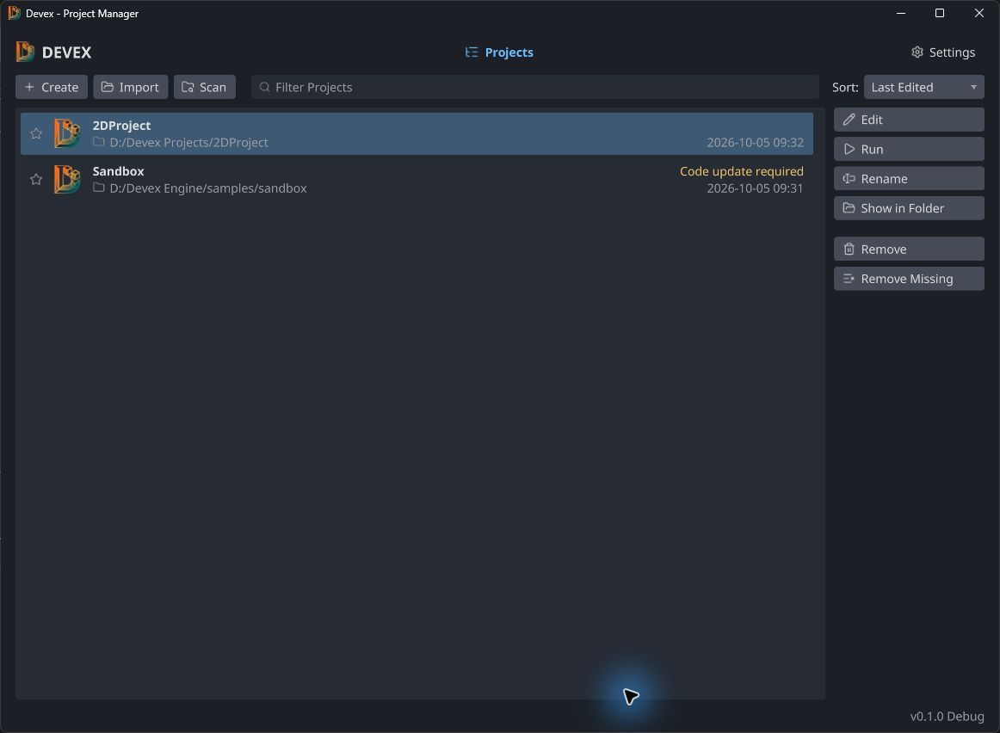
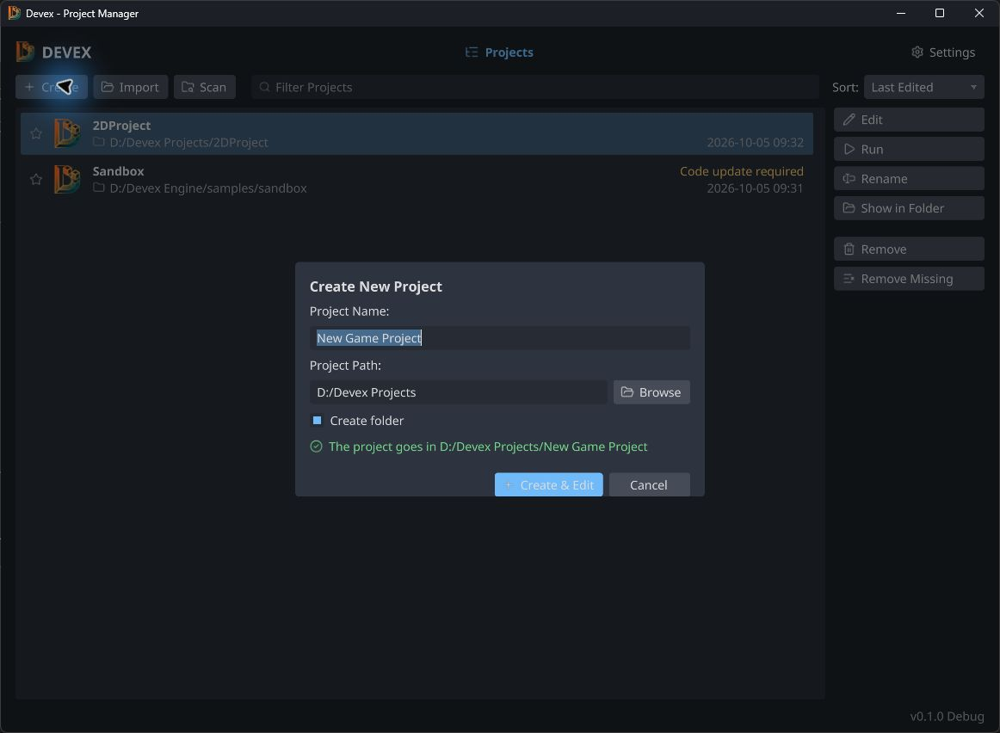
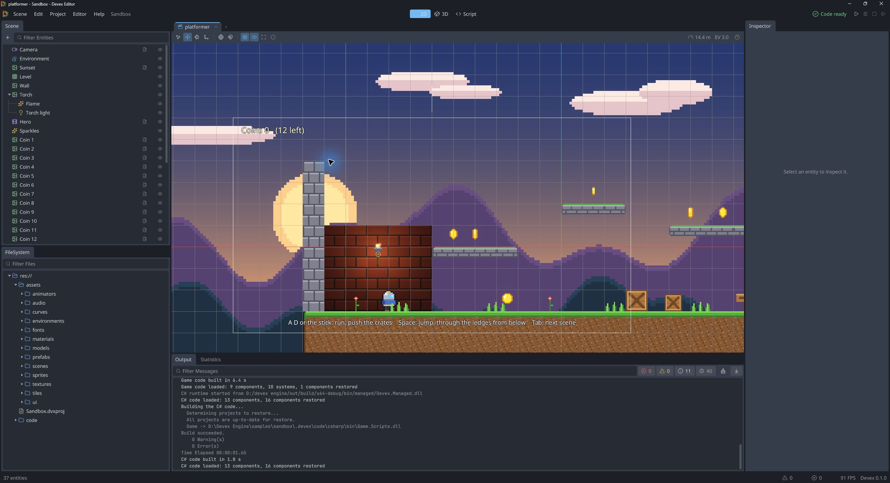
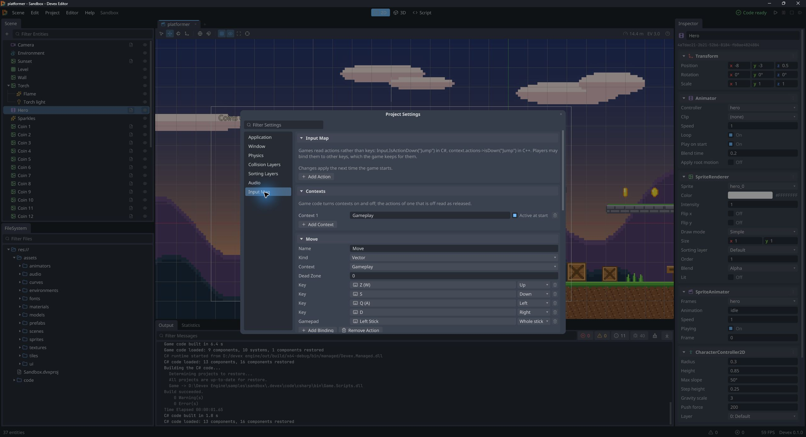
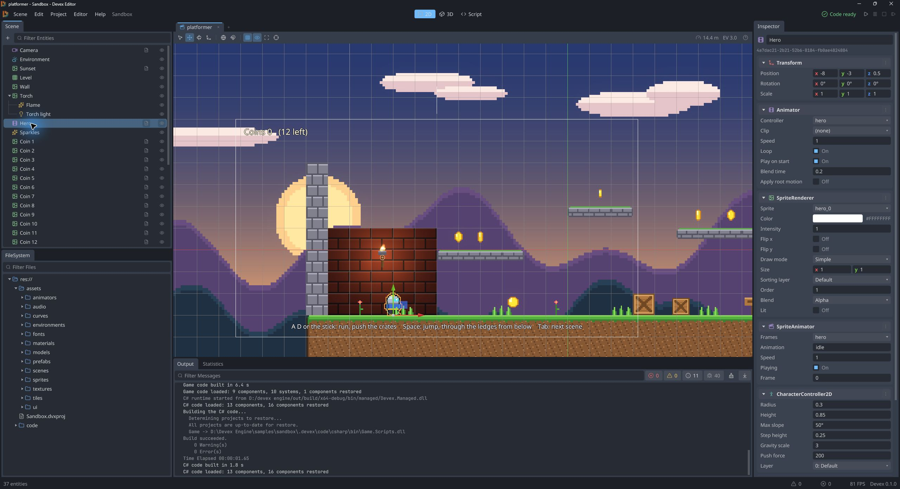
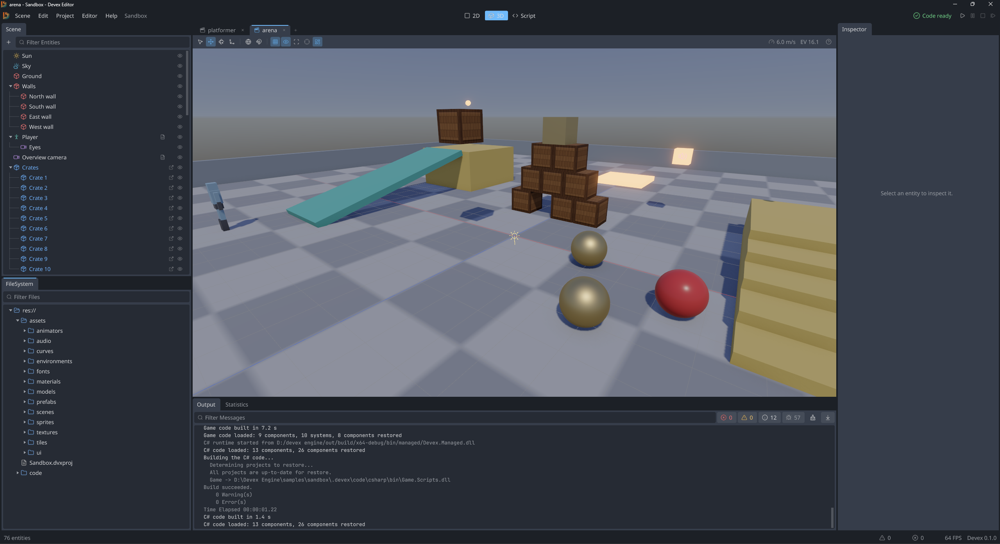

# Créer ses premiers jeux avec Devex Engine

Guide pratique en français — version du moteur examinée le **5 octobre 2026**.

Ce document accompagne la création de deux petits prototypes : un personnage de plateforme en **2D**, puis un personnage en **3D** qui marche et saute sur un sol. Les deux utilisent C#, les mêmes actions d'entrée et une caméra de suivi. On part d'un projet neuf, sans modifier Sandbox.

Les captures sont prises dans Devex. Celles de **Sandbox** montrent où se trouvent les outils et donnent un exemple de résultat plus avancé ; le décor de Sandbox n'est pas créé automatiquement en suivant ce tutoriel. Les noms des menus restent en anglais pour correspondre à l'éditeur.

Les scripts complets sont inclus dans ce document et disponibles séparément dans [examples/guide-demarrage](examples/guide-demarrage). Conserver le dossier `images` à côté de ce Markdown pour afficher les captures hors du dépôt.

## Sommaire

1. [Préparer Devex et créer un projet](#1-préparer-devex-et-créer-un-projet)
2. [Comprendre l'éditeur et organiser ses fichiers](#2-comprendre-léditeur-et-organiser-ses-fichiers)
3. [Configurer les scripts et les touches](#3-configurer-les-scripts-et-les-touches)
4. [Construire le premier jeu 2D](#4-construire-le-premier-jeu-2d)
5. [Ajouter des animations et une carte en tiles](#5-ajouter-des-animations-et-une-carte-en-tiles)
6. [Construire le premier jeu 3D](#6-construire-le-premier-jeu-3d)
7. [Ajouter un objectif au prototype](#7-ajouter-un-objectif-au-prototype)
8. [Sauvegarder, réutiliser et exporter](#8-sauvegarder-réutiliser-et-exporter)
9. [Résoudre les problèmes courants](#9-résoudre-les-problèmes-courants)
10. [Référence rapide et limites de cette base](#10-référence-rapide-et-limites-de-cette-base)

## 1. Préparer Devex et créer un projet

### Ce qu'il faut avoir

- Un build fonctionnel de Devex Editor. Pour compiler le moteur lui-même, suivre les instructions du [README](../README.md).
- Le **SDK .NET 10** pour compiler les scripts C# ; le runtime seul ne suffit pas.
- Un dossier pour les projets, par exemple `D:/Devex Projects`.
- Facultatif : Rider, Visual Studio ou VS Code. L'éditeur de texte intégré **Devex Script** suffit pour commencer.

La programmation C++ demande aussi les outils de compilation configurés pour Devex. Elle n'est pas nécessaire pour les scripts de ce guide.

### Créer le projet



*Le gestionnaire distingue l'ouverture dans l'éditeur (Edit) et le lancement du jeu (Run).*

1. Lancer `devex-editor.exe` pour afficher le gestionnaire.
2. Cliquer sur **Create**.
3. Nommer le projet `MonPremierJeu`.
4. Choisir le dossier parent et laisser **Create folder** activé pour isoler le projet.
5. Cliquer sur **Create & Edit**.



*Ce dialogue choisit le nom et l'emplacement. Le choix 2D/3D se fait ensuite lors de la création de la scène.*

Il est possible de conserver les deux prototypes dans le même projet, dans `Level2D.dvxscene` et `Level3D.dvxscene`. Ils utiliseront les mêmes scripts et la même Input Map. Une seule scène sera choisie comme scène de démarrage du jeu exporté.

## 2. Comprendre l'éditeur et organiser ses fichiers



*Exemple Sandbox : hiérarchie à gauche, scène au centre, Inspector à droite, ressources et messages en bas.*

| Zone | Utilité |
| --- | --- |
| **Scene** | Les entités de la scène ouverte : joueur, caméra, sol, lumières… |
| **Viewport** | La vue de travail pour placer les objets. En Play, elle affiche la caméra du jeu. |
| **Inspector** | Les composants et propriétés de l'entité ou de la ressource sélectionnée. |
| **FileSystem** | Les fichiers du projet : textures, scènes, scripts et ressources. |
| **Output** | Les messages d'import, de compilation et d'exécution ; commencer ici en cas d'erreur. |
| **2D / 3D / Script** | Les espaces de travail. Changer d'espace ne convertit pas une scène ni ses composants physiques. |

### Entité, composant et parent

Une **entité** est un objet de la scène. Les **composants** lui donnent des fonctions : `SpriteRenderer` dessine une image, `Camera` produit la vue du jeu, `BoxCollider2D` définit une collision.

Le `Transform` contient position, rotation et échelle. Un enfant utilise un Transform **local**, relatif à son parent. Déplacer le parent déplace ses enfants.

Contrairement à une organisation où chaque forme est un nœud distinct, un composant n'a pas automatiquement son propre Transform. Pour décaler le dessin d'un personnage sans décaler son contrôleur, placer le dessin sur une **entité enfant Visual**. Les colliders ordinaires possèdent aussi un champ **Center**. Le `CharacterController2D`, lui, possède sa propre capsule définie par **Radius** et **Height**.

### Organisation conseillée

Dans FileSystem, faire un clic droit sur un dossier, puis **Create New**. Choisir **Folder**, donner un nom et une destination. Répéter pour obtenir :

```text
res://
├── MonPremierJeu.dvxproj
├── assets/
│   ├── scenes/       Level2D.dvxscene, Level3D.dvxscene
│   ├── textures/     images PNG et spritesheets
│   ├── sprites/      animations Sprite Frames
│   ├── tiles/        tilesets
│   ├── prefabs/      objets réutilisables
│   ├── models/       modèles 3D
│   └── audio/        sons et musiques
└── code/             scripts C# et projet Game.csproj
```

`res://` désigne la racine du projet. Les scripts créés par Devex restent dans `res://code/`, éventuellement dans des sous-dossiers.

Les fichiers `.dvxmeta` conservent l'identité et les réglages d'import des ressources : les garder avec les fichiers sources, notamment dans Git. Le dossier `.devex` contient des données générées/cache ; ce n'est pas un emplacement pour écrire les scripts. `Game.csproj` est généré par Devex : ne pas y ajouter manuellement une liste de scripts qui sera écrasée à la prochaine génération.

### Manipulations de base

- Le bouton **+** du panneau Scene ouvre le catalogue d'entités. **Empty** crée une entité avec un Transform.
- Sélectionner une entité, puis utiliser **Add Component** dans l'Inspector pour lui ajouter une fonction.
- Pour créer un enfant, créer l'entité puis la faire glisser sur son parent dans la hiérarchie. **Régler son Transform local après le rattachement**.
- **F** cadre la sélection. **W / E / R** activent déplacement, rotation et échelle ; **Q** revient à la sélection. Ces raccourcis concernent l'éditeur hors saisie de texte.
- En 3D, clic droit maintenu et touches de déplacement permettent de naviguer ; **Alt + clic gauche** tourne autour de la scène.
- **Ctrl+S** sauvegarde la scène ; **Ctrl+Shift+S** permet de choisir un autre fichier.

## 3. Configurer les scripts et les touches

### Choisir son éditeur de code

Ouvrir **Editor > Editor Settings… > Script Editors**. Choisir séparément l'éditeur des fichiers **C#**, **C++** et **Devex Files**.

Pour commencer, **Devex Script** évite toute configuration supplémentaire. Avec un IDE détecté, sélectionner son entrée. Pour un éditeur personnalisé, renseigner son exécutable. Laisser les arguments par défaut pour un IDE reconnu : Devex lui transmet le contexte de projet, notamment `code/Game.csproj` pour C# et `code/CMakeLists.txt` pour C++.

Un double-clic sur un script suit ce choix. **Edit in Devex Script** permet toujours de l'ouvrir dans l'éditeur intégré. Pour les scènes et les ressources `.dvx`, les éditeurs visuels conservent leur rôle.

### Éviter de compiler un travail inachevé

Dans **Editor Settings > Compilation**, choisir :

| Mode | Comportement |
| --- | --- |
| **Automatic** | Compile les changements enregistrés, y compris les sauvegardes automatiques d'un IDE externe. |
| **Manual (Ctrl+B)** | Attend **Project > Build Game Code**, ou **Ctrl+B**, après les modifications. Même les sauvegardes dans Devex Script attendent cette commande. |

Avec Rider et ses sauvegardes automatiques, le mode **Manual** est pratique : terminer les modifications, enregistrer, puis compiler volontairement. À l'ouverture d'un projet, Devex peut néanmoins reconstruire un code absent ou périmé. Une compilation réussie recharge le code ; un échec conserve la version précédente. Vérifier **Code ready** et Output avant de considérer un changement comme actif.

### Créer les actions d'entrée

Ouvrir **Project > Project Settings… > Input Map**. Créer un contexte **Gameplay** et cocher **Active at start**. Ajouter ces deux actions, avec exactement cette casse :

| Action | Kind | Context | Liaisons clavier | Manette facultative |
| --- | --- | --- | --- | --- |
| `Move` | **Vector** | Gameplay | Up : Z sur AZERTY / W sur QWERTY ; Down : S ; Left : Q / A ; Right : D | Left Stick, Whole stick |
| `Jump` | **Button** | Gameplay | Espace | South |

Pour chaque touche : **Add Binding**, choisir la source clavier, activer l'écoute de la touche puis appuyer sur la touche voulue. Pour `Move`, choisir aussi la direction **Up**, **Down**, **Left** ou **Right** de chaque liaison.



*Dans Sandbox, le contexte Gameplay est actif au démarrage et Move est un Vector. L'affichage Z (W) ou Q (A) indique la correspondance entre disposition du clavier et touche physique.*

En 2D, le script utilise seulement la composante horizontale de `Move`. En 3D, il utilise les deux composantes. Il faut bien choisir **Vector** : les scripts lisent `Input.ActionVector("Move")`.

Arrêter puis relancer Play après avoir changé l'Input Map. Pendant Play, cliquer dans le viewport pour donner le clavier au jeu.

### Créer et attacher un script

1. Clic droit sur `code` dans FileSystem, puis **Create New > Script**.
2. Choisir **C#**, le nom indiqué dans le tutoriel et un dossier sous `res://code/`.
3. Remplacer le contenu généré par le script complet fourni ci-dessous. Ne pas conserver deux classes du même nom.
4. Enregistrer et compiler avec **Ctrl+B** si nécessaire.
5. Sélectionner l'entité concernée et ajouter le composant de ce nom via **Add Component**.

Créer un script depuis FileSystem ne l'attache pas automatiquement à une entité. Les champs publics comme `Speed` ou `Target` apparaissent dans l'Inspector après compilation. Pour un champ `Entity`, y glisser l'entité depuis Scene ou utiliser le sélecteur proposé.

## 4. Construire le premier jeu 2D

### 4.1 Créer la scène

Choisir **Scene > New 2D Scene**, puis enregistrer dans `res://assets/scenes/Level2D.dvxscene`. La nouvelle scène contient une caméra orthographique. Conserver cette caméra pour le prototype.

L'objectif est cette hiérarchie :

```text
Camera                  Transform, Camera, CameraFollow
Player                  Transform, CharacterController2D, PlayerMovement2D
└── Visual              Transform, SpriteRenderer [puis SpriteAnimator]
Ground                  Transform, SpriteRenderer, BoxCollider2D
```

En 2D, X va vers la droite et Y vers le haut ; Z sert à la profondeur. Un objet dessiné ne devient pas solide automatiquement.

### 4.2 Importer le dessin du personnage

Copier une image PNG dans `assets/textures`, via l'explorateur de fichiers. Pour apprendre avec les mêmes ressources que Sandbox, copier uniquement `samples/sandbox/assets/textures/2d/hero.png` dans le nouveau projet, puis régler son import. Une nouvelle identité sera créée pour cette copie.

Sélectionner la texture dans FileSystem et régler la section **Sprites** de l'Inspector :

| Réglage | Image unique | `hero.png` de Sandbox |
| --- | --- | --- |
| Mode | Single | Grid |
| Columns and rows | Sans objet | 6 et 2 |
| Pixels per unit | À adapter au dessin | 16 |
| Pivot | Bottom pour un point d'origine aux pieds | Bottom, soit (0.5, 0) |
| Filter | Nearest pour du pixel art | Nearest |
| Mipmaps | Désactivées pour ce premier prototype 2D | Désactivées |

Appliquer avec **Reimport**. Développer la texture dans FileSystem pour voir les sprites qu'elle contient. Pour une grille, chaque case devient un sprite distinct.

Les **Pixels per unit** contrôlent la taille dans le monde : une image haute de 32 pixels avec 32 pixels par unité mesure 1 unité. Le pivot **Bottom** place l'origine au milieu du bas de l'image, ce qui facilite l'alignement avec les pieds du joueur.

### 4.3 Créer Player et sa collision

Créer une entité **Empty**, la nommer `Player` et lui ajouter **Character 2D** (`CharacterController2D`). Régler :

| Propriété | Valeur de départ |
| --- | --- |
| Transform Position | (0, 2, 0) |
| Transform Rotation | (0, 0, 0) |
| Transform Scale | (1, 1, 1) |
| Radius | 0.3 |
| Height | 1.0 |
| Step height | 0.25 |
| Gravity scale | 1 |
| Layer | Default |

La position du contrôleur correspond à ses **pieds**. Sa capsule monte le long de Y. `Height` est la hauteur totale, bouts arrondis inclus ; choisir une hauteur supérieure au diamètre `2 × Radius`.

Créer une autre entité Empty nommée `Visual`, la placer sous Player, lui ajouter **Sprite** (`SpriteRenderer`) et remettre son Transform local à position (0, 0, 0), rotation (0, 0, 0), échelle (1, 1, 1). Affecter le premier sprite importé au champ **Sprite**. Désactiver **Lit** pour ce prototype sans éclairage 2D.

Si le sprite a un pivot au centre, le décaler vers le haut : pour un dessin haut de 1 unité, `Visual.Position.Y = 0.5`. Ajuster l'échelle de **Visual** ou les dimensions de la capsule pour que les pieds et le corps coïncident. Garder l'échelle de Player à (1, 1, 1).



*L'Inspector montre SpriteRenderer, SpriteAnimator et CharacterController2D. Sandbox regroupe ici le visuel sur Hero ; notre tutoriel place le visuel sur un enfant pour faciliter son décalage.*

Ne pas ajouter de `RigidBody2D` ou de deuxième collider au même joueur pour « compléter » sa capsule : le contrôleur assure déjà sa collision. Déplacer un collider enfant ne déplace pas la capsule propre au contrôleur.

### 4.4 Créer un sol visible et solide

Pour un sol de test, copier `samples/sandbox/assets/textures/checker.png` dans `assets/textures`. L'importer en **Single**, pivot **Center**, puis Reimport.

Créer `Ground` avec **SpriteRenderer** et **BoxCollider2D** :

| Élément | Réglages |
| --- | --- |
| Transform | Position (0, -0.5, 0), rotation nulle, échelle (1, 1, 1) |
| SpriteRenderer | Sprite de checker ; Draw mode **Tiled** ; Size (12, 1) ; Lit désactivé |
| BoxCollider2D | Size (12, 1) ; Center (0, 0) ; Trigger désactivé |

Le haut du sol est ainsi à Y = 0. Le collider n'a pas besoin de RigidBody2D pour rester statique. Le joueur créé à Y = 2 doit tomber dessus.

Pour ajouter une plateforme, dupliquer cette entité, la déplacer vers (3, 1, 0) et donner une taille (3, 0.5) au dessin **et** au collider. Changer seulement le dessin ne change pas sa collision.

### 4.5 Script PlayerMovement2D

Créer `code/PlayerMovement2D.cs`, coller ce code, compiler et ajouter **PlayerMovement2D** à **Player**.

```csharp
using System;
using Devex;

// À ajouter à Player, avec un CharacterController2D.
public class PlayerMovement2D : Component
{
    public float Speed = 5.0f;
    public float JumpSpeed = 7.0f;
    public Entity Visual;
    public bool Animate = false;

    public override void Update(float delta)
    {
        var controller = Entity.Get<CharacterController2D>();
        float horizontal = Input.ActionVector("Move").X;
        Vec2 velocity = controller.Velocity;
        velocity.X = horizontal * Speed;

        if (controller.Grounded && Input.WasActionPressed("Jump"))
            velocity.Y = JumpSpeed;

        // La simulation applique déjà la gravité et le pas de temps.
        controller.Velocity = velocity;

        if (!Visual.IsAlive)
            return;

        if (Visual.TryGet<SpriteRenderer>(out var sprite) && MathF.Abs(horizontal) > 0.01f)
            sprite.FlipX = horizontal < 0.0f; // Image d'origine tournée à droite.

        if (Animate && Visual.TryGet<SpriteAnimator>(out var animator))
        {
            string animation = !controller.Grounded || velocity.Y > 0.1f
                ? "jump"
                : MathF.Abs(horizontal) > 0.01f ? "run" : "idle";
            animator.Play(animation);
        }
    }
}
```

Dans l'Inspector du script :

- **Speed** : 5 ; **Jump speed** : 7.
- **Visual** : l'enfant Visual.
- **Animate** : désactivé tant que les animations ne sont pas configurées.

Le script conserve la vitesse verticale calculée par la physique. Il n'ajoute pas une deuxième gravité et ne multiplie pas la vitesse par `delta` : la simulation s'occupe déjà du temps. Le saut est lu dans `Update`, car `WasActionPressed` correspond à une pression pendant une image.

### 4.6 Caméra 2D et suivi

La caméra doit rester **à la racine**, sans parent. Régler :

| Propriété | Valeur |
| --- | --- |
| Position initiale | (0, 3, 10) |
| Rotation | (0, 0, 0) |
| Projection | Orthographic |
| Orthographic size | 5 |
| Primary | Activé |
| Auto exposure | Désactivé |
| EV100 | 3 |
| Tonemapper | None |
| Antialiasing | None pour cette base pixel art |
| Bloom / Ambient occlusion | 0 |

`Orthographic size = 5` représente une demi-hauteur : la vue couvre environ 10 unités verticales. Plus la valeur est petite, plus le personnage paraît grand. La caméra regarde suivant son axe local **-Z** : à Z = 10 sans rotation, elle voit les objets proches de Z = 0.

Créer `code/CameraFollow.cs`, compiler et l'ajouter à **Camera** :

```csharp
using Devex;

// À ajouter à une Camera à la racine de la scène, sans parent.
public class CameraFollow : Component
{
    public Entity Target;
    public Vec3 Offset = new(0.0f, 2.0f, 10.0f);

    public override void LateUpdate(float delta)
    {
        if (Target.IsAlive && Target.HasTransform)
            Transform.Position = Target.WorldPosition + Offset;
    }
}
```

Affecter **Target = Player** et **Offset = (0, 2, 10)**. Le suivi est volontairement direct, sans lissage supplémentaire. `LateUpdate` lit la position déjà interpolée par la physique pour éviter qu'une caméra ne suive une pose différente de celle qui est dessinée.

Une caméra ajoutée avec le préréglage **2D camera** n'est pas nécessairement principale : vérifier **Primary**. Ne garder qu'une caméra principale dans cette scène.

### 4.7 Premier lancement

1. Enregistrer la scène et compiler les scripts.
2. Vérifier **Code ready** et l'absence d'erreur dans Output.
3. Appuyer sur **F5**, puis cliquer dans la vue du jeu.
4. Le personnage tombe sur le sol ; Q/D ou A/D le déplacent, Espace le fait sauter.
5. **F8** arrête le jeu et revient à l'édition.

**Point de contrôle :** le sol doit rester solide, le joueur doit être visible et la caméra doit le suivre. Corriger ces trois points avant d'ajouter l'animation ou les tiles.

## 5. Ajouter des animations et une carte en tiles

### 5.1 Créer les animations du sprite

1. Dans `assets/sprites`, ouvrir **Create New > Sprite Frames**. Nommer la ressource `PlayerFrames` et choisir sa destination.
2. Sélectionner cette ressource pour ouvrir son Inspector.
3. Utiliser **Add Animation**, nommer la première `idle`.
4. Faire glisser les sprites voulus depuis FileSystem dans **Frames**, dans l'ordre souhaité.
5. Choisir **Frames per second** et **Loop**. Recommencer pour `run` et `jump`.

| Animation | Point de départ | Contenu |
| --- | --- | --- |
| `idle` | 4 à 8 images/s, Loop activé | Le personnage immobile |
| `run` | 8 à 12 images/s, Loop activé | Les poses de marche/course |
| `jump` | 1 image suffit, Loop activé | Une pose en l'air |

Pour ce script simple, `jump` couvre toute la durée en l'air. Séparer montée et chute demanderait une quatrième animation et une condition supplémentaire.

Ajouter **SpriteAnimator** sur **Visual**, affecter **Frames = PlayerFrames**, choisir `idle`, vitesse 1 et Playing activé. Activer ensuite **Animate** dans PlayerMovement2D. Les noms `idle`, `run`, `jump` doivent correspondre exactement à ceux de la ressource.

Ne pas ajouter un **Animator** qui pilote simultanément ces mêmes animations : pour ce premier jeu, le script et SpriteAnimator suffisent. L'asset Animator sert à construire une machine à états plus avancée, avec paramètres et transitions.

### 5.2 Construire un niveau avec une Tilemap

Le sol rectangulaire précédent suffit pour apprendre. Pour dessiner une carte :

1. Copier une image de tiles dans `assets/textures` et l'importer en **Grid**, avec les bonnes colonnes/lignes et Pixels per unit.
2. Dans `assets/tiles`, choisir **Create New > Tileset** et nommer la ressource `LevelTiles`.
3. Dans son Inspector, ajouter les sprites de tiles par glisser-déposer.
4. Sélectionner chaque tile et définir sa **Collision**.
5. Créer une entité avec **Tilemap**, lui affecter le tileset, puis utiliser les outils de peinture de la vue 2D pour dessiner les cellules.

| Collision de la tile | Résultat |
| --- | --- |
| **None** | Décoration traversable |
| **Full** | Sol ou mur solide |
| **Top** | Plateforme traversable depuis le bas, solide par-dessus |

Faire correspondre la taille des cellules, les Pixels per unit et l'échelle du personnage. Une tile visible avec Collision = None ne bloque pas le joueur. Éviter de superposer l'ancien Ground et une seconde surface de collision au même endroit : déplacer l'ancien sol hors du niveau ou le retirer une fois la Tilemap vérifiée.

#### Laisser les terrains choisir les tiles

Peindre chaque bord et chaque coin à la main devient vite long. Les terrains choisissent la bonne tile d'après les cellules voisines, comme dans Godot :

1. Dans l'Inspector du tileset, carte **Terrains**, cliquer **Add Terrain Set**. Choisir le mode **Match Sides** (16 tiles suffisent) ou **Match Corners and Sides** (coins intérieurs compris), puis nommer le terrain, par exemple `Ground`.
2. Activer **Flip X** si les bords gauche et droit sont symétriques : un seul bord dessiné sert des deux côtés.
3. En haut de la carte **Tiles**, choisir `Ground` dans **Paint Terrain**, puis cliquer sur le milieu, les côtés et les coins de chaque tile pour indiquer où elle continue le terrain. Le clic droit efface une part.
4. Sous la **Tilemap**, passer sur l'onglet **Terrains**, choisir `Ground`, puis peindre avec **Paint** ou **Rectangle** : chaque cellule prend la tile qui convient, et les voisines suivent. **Path** relie seulement les cellules successives du trait (routes, rivières).

En C#, `Tilemaps.SetTerrain(map, cells, set, terrain)` fait la même chose depuis le code ; `Tilemaps.FindTerrain(map, "Ground")` retrouve l'ensemble et le terrain par leur nom.

#### Éclairer le niveau en 2D

Comme dans Godot, l'éclairage 2D ne dépend pas des lumières 3D :

1. Ajouter une entité **Canvas modulate** et choisir une teinte sombre (bleu nuit) : tout le 2D s'assombrit.
2. Ajouter une **Point light 2D** près d'une torche : elle éclaire les sprites et les tiles dans son **Radius**. Activer **Shadows** pour qu'elle projette des ombres.
3. Ajouter des **Light occluder 2D** autour de ce qui doit faire de l'ombre, ou cocher **Occluder** sur les tiles concernées dans l'Inspector du tileset.
4. Pour du relief, importer une normal map avec **Normal map** activé, puis la choisir dans la ligne **Normal Map** de la planche de sprites et cliquer **Reimport**.

Un sprite marqué **Unshaded** garde ses couleurs, et les masques (boutons 1 à 8) choisissent quelles lumières éclairent quoi.

## 6. Construire le premier jeu 3D



*Capture fournie depuis Devex : la scène arena de Sandbox montre le sol, les obstacles, les objets physiques, le soleil et l'environnement. Elle illustre l'espace de travail 3D ; la scène neuve du tutoriel commence avec un décor beaucoup plus simple.*

### 6.1 Créer une scène éclairée

Choisir **Scene > New 3D Scene** et enregistrer sous `res://assets/scenes/Level3D.dvxscene`. Utiliser l'espace **3D**.

La scène de base contient une caméra, une lumière directionnelle, un environnement, un sol visuel et un cube. Conserver la lumière et l'environnement pour commencer : ils permettent de voir les objets avec le rendu 3D. Le sol et le cube de démonstration ne reçoivent pas automatiquement des collisions.

Dans ce parcours, on utilise un **RigidBody dynamique et une CapsuleCollider** pour contrôler un personnage en C#. Le moteur dispose aussi de `CharacterController` 3D, utilisé notamment par le joueur C++ de Sandbox. Dans la version examinée, ses champs de vitesse et de contact au sol ne sont pas exposés à C# ; copier l'API du contrôleur 2D ne fonctionnerait donc pas. Le corps dynamique ci-dessous fournit une base simple réellement accessible en C#.

La hiérarchie visée :

```text
Sun                     DirectionalLight
Sky                     SkyEnvironment
Camera                  Camera, CameraFollow
Ground                  MeshRenderer, BoxCollider
Cube                    MeshRenderer, BoxCollider
Player                  RigidBody, CapsuleCollider, PlayerMovement3D
└── Visual              MeshRenderer (cube de test)
```

Tous les objets placés possèdent aussi un Transform. Le nom exact de l'entité d'environnement peut différer ; conserver celle générée par la nouvelle scène.

### 6.2 Rendre le sol solide

Le préréglage de nouvelle scène utilise un plan de taille agrandie. Pour ce sol :

| Élément | Réglage |
| --- | --- |
| Ground Transform | Position (0, 0, 0), rotation (0, 0, 0), Scale (20, 1, 20) |
| MeshRenderer | Conserver le mesh Plane |
| BoxCollider à ajouter | Size (1, 0.1, 1), Center (0, -0.05, 0), Trigger désactivé |

Le collider suit l'échelle de l'entité : ses dimensions dans le monde deviennent **20 × 0.1 × 20**. Son haut coïncide avec le plan visible à Y = 0. Il reste statique sans RigidBody.

Déplacer le cube initial vers (3, 0.5, 0), garder son échelle à (1, 1, 1) et lui ajouter un **BoxCollider** de Size (1, 1, 1). Il devient un obstacle. Le catalogue **Static box** peut aussi créer directement un cube visible avec collision.

### 6.3 Créer le personnage 3D

Créer une entité Empty nommée `Player`, à position **(0, 2, 2)**, rotation nulle et échelle (1, 1, 1). Ajouter les composants suivants :

| Composant | Réglages |
| --- | --- |
| **RigidBody** | Type **Dynamic** ; Mass 70 ; Friction 0 ; Restitution 0 ; Linear damping 0 ; Gravity scale 1 |
| RigidBody, rotations | **Lock rotation X, Y et Z activés** pour que le personnage reste debout |
| **CapsuleCollider** | Radius 0.35 ; Height 1.8 ; Center (0, 0.9, 0) ; Trigger désactivé |

Ici nous choisissons explicitement une origine aux pieds : la capsule est centrée 0.9 unité au-dessus du Transform. Le script de détection du sol dépend de cette convention. Modifier sa hauteur demande d'adapter son centre pour conserver le bas à Y local = 0.

Créer un **Cube** nommé `Visual`, le placer sous Player, puis régler son Transform local : Position **(0, 0.9, 0)**, Rotation (0, 0, 0), Scale **(0.7, 1.8, 0.7)**. Ce cube représente le personnage. Il conserve son MeshRenderer mais n'a pas besoin d'un collider supplémentaire.

Ne pas ajouter `CharacterController` en plus de RigidBody dans cette variante. Le corps dynamique et la capsule suffisent.

### 6.4 Script PlayerMovement3D

Créer `code/PlayerMovement3D.cs`, compiler et ajouter le composant à **Player** :

```csharp
using Devex;

// À ajouter à Player, avec RigidBody (Dynamic) et CapsuleCollider.
// Le Transform est aux pieds ; la capsule mesure 1.8 et son Center.Y vaut 0.9.
public class PlayerMovement3D : Component
{
    public float Speed = 5.0f;
    public float JumpSpeed = 6.0f;

    public override void Update(float delta)
    {
        var body = Entity.Get<RigidBody>();
        Vec2 move = Input.ActionVector("Move");
        Vec3 velocity = body.LinearVelocity;
        velocity.X = move.X * Speed;
        velocity.Z = -move.Y * Speed; // Avancer = -Z, avec la caméra derrière le joueur.

        Vec3 foot = Entity.WorldPosition;
        bool grounded = velocity.Y <= 0.1f
            && Physics.Raycast(foot + new Vec3(0.0f, 0.1f, 0.0f),
                               new Vec3(0.0f, -1.0f, 0.0f), 0.2f,
                               out RayHit hit, ignore: Entity)
            && hit.Normal.Y > 0.6f;

        if (grounded && Input.WasActionPressed("Jump"))
            velocity.Y = JumpSpeed;

        body.LinearVelocity = velocity;
    }
}
```

Conserver Speed = 5 et Jump speed = 6. Le mouvement se fait sur le plan **XZ** ; Y est la hauteur. Avancer va vers **-Z**. La caméra décrite ci-dessous garde une orientation fixe, donc gauche et droite restent cohérents à l'écran.

Le rayon part près des pieds et cherche un sol sous le personnage, en ignorant son propre corps. Ce test simple convient au sol plat du prototype. Sur des escaliers ou au bord d'une plateforme, il est moins complet qu'un véritable contrôleur de personnage : il n'offre ni montée automatique des marches, ni gestion avancée des pentes, ni délai de saut après avoir quitté un rebord.

### 6.5 Caméra 3D

Réutiliser **CameraFollow.cs** : ne pas créer une deuxième classe du même nom si le script existe déjà dans le projet. Ajouter le composant à la caméra de la scène 3D.

| Propriété | Valeur |
| --- | --- |
| Camera, parent | Aucun : caméra à la racine |
| Transform Rotation | X = -15°, Y = 0°, Z = 0° |
| Projection | Perspective |
| Vertical FOV | 60° |
| Primary | Activé, une seule caméra principale |
| CameraFollow Target | Player |
| CameraFollow Offset | (0, 3, 7) |

La caméra se trouve derrière le personnage, côté +Z, et regarde légèrement vers le bas. Garder pour l'instant l'exposition et l'éclairage de la scène 3D générée. Cette caméra ne contourne pas les murs : dans ce premier niveau ouvert, laisser de l'espace derrière le joueur.

### 6.6 Jouer et enrichir la scène

Sauvegarder, compiler puis **F5** et cliquer dans le viewport. ZQSD/WASD déplacent le personnage ; Espace saute. Il doit tomber sur le plan et être bloqué par le cube.

Ensuite, ajouter quelques **Static box** pour construire un petit parcours. Régler leurs Transform pour modifier position et dimensions. Pour un objet qui tombe ou qu'on peut pousser, utiliser **Rigid box**, qui possède déjà un RigidBody et un collider.

Un modèle 3D importé remplace ensuite le cube Visual. Garder la physique sur Player et régler position, rotation et échelle de l'enfant visuel pour aligner le modèle avec les pieds. Le mesh visible et la forme physique sont deux réglages distincts ; un modèle importé ne garantit pas la présence d'un collider.

**Point de contrôle :** le joueur reste debout, saute, touche le sol, heurte l'obstacle et reste dans le champ de la caméra.

### 6.7 Donner un shader à un objet

Les matériaux standard suffisent au prototype. Pour un effet (eau, objet qui se dissout, contour, éclairage en aplats), Devex reprend les shaders de Godot, écrits en Slang :

1. Dans FileSystem, **Create New > Shader**, type **Spatial (meshes)**. Le fichier `.dvxshader` s'ouvre dans l'éditeur de texte.
2. Dans `fragment()`, écrire par exemple `ALBEDO = albedo * (0.5 + 0.5 * sin(TIME));`. Chaque sauvegarde recompile le shader : une erreur s'affiche dans la console et dans la marge, sur sa ligne.
3. Sélectionner le shader puis **New Material**, ou **Create New > Material** puis choisir le shader dans l'inspecteur du matériau. Les `uniform` du shader y apparaissent comme réglages.
4. Glisser le matériau sur le MeshRenderer de l'objet. Un shader **Canvas Item** se donne de la même façon au champ Material d'un SpriteRenderer en 2D.

La scène `shaders.dvxscene` du bac à sable montre de l'eau, une statue qui se dissout, un éclairage toon, des braises et un ciel procédural.

## 7. Ajouter un objectif au prototype

Une fois le mouvement maîtrisé, ajouter une zone d'arrivée permet de donner une règle simple au jeu, sans menu ni interface complexe.

1. En 2D, créer une entité `Finish` avec BoxCollider2D, **Trigger activé**, position (4, 1, 0), Size (1, 2).
2. En 3D, créer une entité `Finish` avec BoxCollider, **Trigger activé**, position (0, 1, -5), Size (2, 2, 2).
3. Lui donner un visuel distinct, par exemple un sprite en 2D ou un cube coloré en 3D. Une forme trigger seule est invisible en jeu.
4. Créer et attacher le script `FinishZone` ci-dessous à Finish, puis affecter **Player** dans son Inspector.

```csharp
using Devex;

public class FinishZone : Component
{
    public Entity Player;
    private bool _won;

    public override void OnTriggerEnter(Entity other)
    {
        if (_won || !Player.IsAlive || other != Player)
            return;

        _won = true;
        Log.Info("Victoire ! Tu as atteint l'arrivee.");
    }
}
```

Le message de victoire apparaît dans **Output**, pas encore dans un HUD. Ce script valide la boucle « déplacement → arrivée → victoire ». Une nouvelle partie réinitialise la variable privée. Pour continuer, remplacer le message par un panneau de victoire ou un changement de scène.

Un trigger détecte les passages sans bloquer le joueur. Laisser le collider du sol **non trigger** : sinon il ne retient plus le personnage.

## 8. Sauvegarder, réutiliser et exporter

### Scène de départ et objets réutilisables

Enregistrer la scène voulue puis choisir **Project > Set Scene as Startup**. Vérifier aussi **Project Settings > Application > Startup Scene**. Le projet peut contenir plusieurs scènes ; l'export et Run doivent savoir laquelle démarrer.

Pour réutiliser un joueur, conserver sa hiérarchie et ses composants dans une scène dédiée, puis l'instancier comme prefab dans les niveaux. Devex utilise des scènes `.dvxscene` pour ces objets réutilisables. Une caméra de suivi placée dans chaque niveau doit alors cibler **l'instance** du joueur de ce niveau.

Au début, terminer le prototype dans une seule scène évite de devoir gérer en même temps les références entre entités, les instances et leurs modifications.

### Sauvegardes et versionnement

Sauvegarder régulièrement les scènes et les scripts. Dans un dépôt de jeu, conserver le `.dvxproj`, les sources dans `code`, les fichiers d'assets et leurs `.dvxmeta`. Les caches `.devex`, dossiers `bin`/`obj` et résultats d'export sont des données générées à traiter séparément.

Ne pas utiliser le dossier de sortie de l'export comme dossier de travail du projet. Pour partager le guide, conserver aussi ses images et ses exemples.

### Produire un jeu Windows

1. Arrêter Play et sauvegarder les scènes.
2. Compiler le code ; résoudre les erreurs avant d'exporter.
3. Définir la bonne scène de démarrage.
4. Ouvrir **Project > Export Game…**.
5. Choisir un dossier de sortie dédié, par exemple `export/windows`.
6. Choisir **Release** pour distribuer le jeu. Devex doit disposer d'un build Release du moteur ; consulter le README pour le produire si seul le build Debug existe.
7. Inclure les autres scènes utilisées par le jeu. Pour les assets chargés uniquement par chemin à l'exécution, utiliser les dossiers à inclure afin de ne pas dépendre seulement des références directes.
8. Lancer l'export et consulter son résultat dans la fenêtre et Output.
9. Tester l'exécutable produit, nommé d'après le projet, **depuis le dossier exporté**.

Partager tout le dossier exporté : l'exécutable dépend du paquet d'assets et des bibliothèques livrées à côté. Un jeu C# exporté emporte son runtime .NET ; le joueur n'a pas besoin du SDK utilisé pour développer. Un export Debug est réservé au développement et demande les dépendances de debug appropriées.

L'export peut remplacer les fichiers de sa destination. Choisir un dossier consacré uniquement aux résultats d'export.

## 9. Résoudre les problèmes courants

| Symptôme | Vérifications, dans l'ordre |
| --- | --- |
| **Écran gris en Play** | Vérifier qu'une caméra est Primary dans la scène jouée. En 2D : position Z = 10, rotation nulle, objets autour de Z = 0, projection orthographique. Vérifier ensuite le champ de vision et les cibles du suivi. La vue d'édition n'est pas la caméra du jeu. |
| **Le joueur disparaît immédiatement** | Vérifier le collider du sol, Trigger désactivé, dimensions et couches de collision. Le joueur peut simplement tomber hors du champ. |
| **Le joueur ne bouge pas** | Cliquer dans le viewport ; vérifier Move/Jump, leur casse, le contexte Gameplay actif et Kind = Vector pour Move ; vérifier que le script est attaché au joueur et que la dernière compilation a réussi. |
| **Le saut ne fonctionne pas** | Jump doit être Button avec Espace. En 2D, le contrôleur doit toucher le sol. En 3D, conserver l'origine aux pieds, Capsule Center.Y = 0.9 et Height = 1.8 pour le rayon du script. |
| **Le personnage 3D roule ou tombe sur le côté** | Activer les trois Lock rotation du RigidBody. Ne pas lui ajouter en plus un CharacterController. |
| **Le sprite n'apparaît pas** | Importer la texture en Single ou Grid puis Reimport ; affecter un sprite au SpriteRenderer ; contrôler couleur/alpha, taille, caméra et Z. Pour cette base 2D, Lit est désactivé. |
| **Le sprite est très grand ou très petit** | Vérifier Pixels per unit. Ajuster Visual plutôt que l'échelle de la racine physique ; vérifier aussi Orthographic size. |
| **La collision est mal alignée** | Le contrôleur 2D est aux pieds ; régler Radius/Height et le Transform de Visual. Pour les colliders ordinaires, régler Center. Ne pas confondre contour du dessin et forme physique. |
| **Les tiles sont traversables** | Définir leur Collision dans le Tileset : Full pour les murs/sols, Top pour les plateformes à sens unique. None est décoratif. |
| **L'animation reste immobile** | Vérifier Frames, les noms idle/run/jump, Playing et Animate. SpriteAnimator doit être sur la même entité que SpriteRenderer, donc Visual dans ce guide. |
| **Caméra qui tremble malgré des FPS élevés** | Utiliser CameraFollow en LateUpdate avec Target.WorldPosition, garder la caméra sans parent et retirer les autres scripts qui modifient sa position. Ne pas suivre alternativement une pose physique et une pose interpolée. |
| **Image pixel art floue** | Vérifier Filter = Nearest et l'échelle. Un zoom non entier peut encore produire des irrégularités ; ce guide ne configure pas un rendu pixel-perfect complet. |
| **Scene 3D trop sombre** | Vérifier lumière directionnelle, environnement, matériau et exposition de la caméra. Un changement de vue 2D/3D n'ajoute pas de lumière. |
| **Rider ne reconnaît pas l'API Devex** | Ouvrir avec l'IDE configuré dans Script Editors et le contexte Game.csproj, pas seulement un fichier isolé. Compiler une fois dans Devex pour générer les références ; vérifier le SDK .NET. |
| **Le code ne se met pas à jour** | En mode Manual, sauvegarder puis Ctrl+B. Lire la première erreur dans Output : après un échec, l'ancien code peut encore être actif. |
| **CS0579 / attributs d'assembly en double** | Vérifier que le moteur est à jour et que des sources générées de bin/obj/cache ne sont pas ajoutées comme scripts du jeu. Ne pas masquer le problème en supprimant arbitrairement les attributs de la classe. Garder le Game.csproj généré par Devex. |
| **Unknown action** | Ajouter l'action avec exactement le nom lu par le script. `Move` et `move` ne sont pas interchangeables. |
| **Erreur “component not found” ou équivalente** | Le script exige un composant absent : CharacterController2D pour PlayerMovement2D ; RigidBody pour PlayerMovement3D. Vérifier l'entité qui porte le script. |
| **L'export échoue en Release** | Vérifier le build Release du moteur et la compilation du code du jeu. Lire la première erreur d'export ; ne pas supposer qu'un build Debug produit tous les fichiers Release. |

Pour isoler un problème, revenir à une caméra, un joueur et un sol. Valider ce trio puis réactiver les systèmes supplémentaires un par un.

## 10. Référence rapide et limites de cette base

### Raccourcis utiles

| Raccourci | Action |
| --- | --- |
| Ctrl+S | Enregistrer la scène ou le document édité selon le contexte |
| Ctrl+Shift+S | Enregistrer la scène sous un autre nom |
| Ctrl+B | Compiler le code du jeu |
| F5 | Jouer |
| F7 | Mettre en pause / reprendre pendant Play |
| F8 | Arrêter Play |
| F9 | Avancer d'un pas lorsque le jeu est en pause |
| F | Cadrer la sélection dans la vue |
| Q / W / E / R | Sélection / déplacement / rotation / échelle dans la vue d'édition |

### Ce qui relève de l'image ou de la physique

| Besoin | 2D | 3D |
| --- | --- | --- |
| Dessiner le personnage | SpriteRenderer | MeshRenderer |
| Animer le dessin | SpriteAnimator, éventuellement Animator ensuite | Animation/Animator sur un modèle adapté |
| Forme physique du joueur de ce guide | Capsule interne au CharacterController2D | CapsuleCollider avec RigidBody Dynamic |
| Sol simple | BoxCollider2D | BoxCollider |
| Détection sans obstacle | Collider avec Trigger | Collider avec Trigger |
| Vue du jeu | Camera orthographique | Camera perspective |
| Suivi de caméra | CameraFollow en LateUpdate | Le même CameraFollow, autre Offset |

### Ce que les scripts fournissent

- Déplacement immédiat, saut au sol et contrôle en l'air.
- Gravité et collisions prises en charge par le moteur.
- Caméra de suivi fixe ; animation 2D facultative.
- Zone d'arrivée qui écrit un message de victoire.

Ils ne fournissent pas encore de caméra avec collision, de rotation de caméra à la souris, de gestion de vie, de checkpoint, de sauvegarde de partie, de menu, ni de contrôleur 3D avancé pour les escaliers. Ce sont des étapes suivantes, après validation du prototype.

### Fichiers fournis et sources de référence

| Fichier | À placer dans le projet | À attacher à |
| --- | --- | --- |
| [PlayerMovement2D.cs](examples/guide-demarrage/PlayerMovement2D.cs) | code/PlayerMovement2D.cs | Player de la scène 2D |
| [PlayerMovement3D.cs](examples/guide-demarrage/PlayerMovement3D.cs) | code/PlayerMovement3D.cs | Player de la scène 3D |
| [CameraFollow.cs](examples/guide-demarrage/CameraFollow.cs) | code/CameraFollow.cs | Chaque caméra principale, avec sa propre cible |
| [FinishZone.cs](examples/guide-demarrage/FinishZone.cs) | code/FinishZone.cs | Zone d'arrivée, facultative |

Les exemples peuvent coexister dans le même dossier `code`. Ne pas créer de deuxième classe portant le même nom dans un autre fichier du projet.

Pour approfondir l'implémentation correspondant à ce guide : [API des composants C#](../managed/Devex.Managed/Component.cs), [entrées](../managed/Devex.Managed/Input.cs), [services physiques et animations](../managed/Devex.Managed/Services.cs), [composants physiques 2D](../engine/include/devex/scene/Physics2DComponents.hpp), [composants physiques 3D](../engine/include/devex/scene/PhysicsComponents.hpp), [exemple de plateforme Sandbox](../samples/sandbox/code/Platformer.cs) et [joueur 3D C++ de Sandbox](../samples/sandbox/code/Sandbox.cpp).

Les captures documentent l'interface observée ; les valeurs des tableaux définissent les prototypes à construire. La validation de compilation des exemples ne remplace pas les points de contrôle en Play, qui dépendent aussi des composants, références et réglages de la scène.
